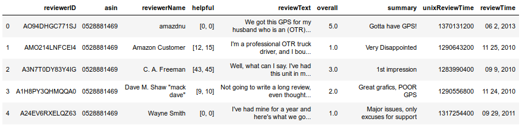

# InfoRecovery-Repo
Repositório da disciplina de Sistemas de Recuperação de Informação do curso de Mestrado em Matemática Aplicada da [EMAP-FGV](https://emap.fgv.br/mestrado/modelagem-matematica).

- Professor: [Flávio Codeço Coelho](https://emap.fgv.br/corpo-docente/flavio-codeco-coelho)

-----

## Sobre o *corpus* 

Para essa disciplina, escolhi utilizar um *corpus* que contém *reviews* de produtos eletrônicos do site [Amazon.com](www.amazon.com). Esse corpus, e outros semelhantes, podem ser encontrados nesse [link](http://jmcauley.ucsd.edu/data/amazon/). 

O *dataset* utilizado contém, no total, 1.689.188 observações e o arquivo de texto em `.csv` ocupa 1.27 GB em disco. Por essa razão, uma amostra de exemplo foi adicionada à esse repositório (contendo aprox. 10 mil *reviews*). Para mais detalhes sobre como essa amostra de exemplo foi construída, vide a pasta `preparing_corpus`.

O conjunto de dados têm a seguinte estrutura:

 

A principal coluna de interesse é `reviewText`, que contém o texto escrito pelo usuário do site a respeito de um determinado produto eletrônico. É sobre os textos presente nessa coluna que vamos aplicar técnicas de *Information Recovery*. 


## Requisitos

Para executar os notebooks presentes nas pastas _`hw*`_ (criados em resposta aos *homeworks* dessa disciplina), são necessárias as seguintes bibliotecas em Python 3:

```
nltk - collections - os - string - pandas - whoosh  
```

A maioria delas pode ser instalada com o comando:
```bash
pip install nome_da_biblioteca
```

Ou, se estiver usando uma distribuição Anaconda,
```bash
conda install nome_da_biblioteca
```

## Como executar os notebooks

Para isso, basta importar o dataset de exemplo no começo dos notebooks com o comando:

```Python
import pandas as pd

corpus = pd.read_csv('../sample_data.csv', sep=',', encoding='utf-8', index_col=0)
```

A partir daí, o restante do código deve ser executado sem grandes problemas.


-----